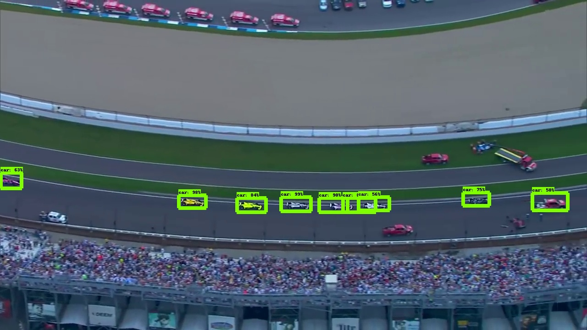

# IndyCar - RaceCar Detection

*Selahattin Akkas\*, Sahaj Singh Maini, Judy Qiu*

This repo contains our dataset and the code for our paper [A Fast Video Image Detection using TensorFlow
Mobile Networks for Racing Cars](http://ipcc.soic.iu.edu/WebsitePaper/conference_workshop/A%20Fast%20Video.pdf).


## Dataset

The dataset contains 3761 images and annotations. It is provided in the `dataset.zip` file.


## Race Car Detection Example

`


## Dependencies

```bash
pip install tensorflow-gpu==1.14.0
sudo apt-get install protobuf-compiler python-pil python-lxml python-tk
pip install --user Cython
pip install --user contextlib2
pip install --user jupyter
pip install --user matplotlib
sudo apt-get install python-opencv
```

p.s. This work was done on TensorFlow 1.x. It might not work with TensorFlow 2.x.

## Clone TensorFlow Models

```
git clone https://github.com/tensorflow/models
```


## System Variables

You can add the following lines to `.bashrc` file. Do not forget to change `<path>` with actual path.

```
export PYTHONPATH=$PYTHONPATH:<path>/models/research:<path>/models/research/slim
```

Then

```
source ~/.bashrc
```


## Install COCOAPI

```
git clone https://github.com/cocodataset/cocoapi.git
cd cocoapi/PythonAPI
make
cp -r pycocotools ../../models/research/
cd ../..
```


## Protobuf-compiler Installation

```
cd models/research
wget -O protobuf.zip
https://github.com/google/protobuf/releases/download/v3.0.0/protoc-3.0.0-linuxx86_
64.zip
unzip protobuf.zip
./bin/protoc object_detection/protos/*.proto --python_out=.
```


## Check Installation

```
# you should be in models/research directory
python object_detection/builders/model_builder_test.py
```

If you see any errors related to protobuf, please check this page: https://github.com/tensorflow/models/blob/master/research/object_detection/g3doc/installation.md


## Data Preparation

```
cd ../../
cd indycar_data_prepare
```

There are ten samples in the folder. You should unzip the images and annotations and  put them into images and annotations folders. `automated_converter.py` file will automatically convert your data to TFRecord format. However, it will split images data to training and validation. If you want to change the ratio, update the following lines in the file:

```
# train, validation
val_ratio = 0.15
train_ratio = 1 - val_ratio # 0.85
```

Then run:

```
python automated_converter.py
```


## Models

You can see model codes in `models/research/slim/nets` folder. Note that you will have this folder if you cloned TensorFlow Models.


## pipeline.config

`pipeline.config` files contain hyper parameters. They are under `ssd_mobilenet_v1_quantized_coco` ,
`ssd_mobilenet_v2_quantized_coco` , and `ssd_resnet_50_fpn_coco` folders.


## Training

To train SSD MobileNetV1:

```
cd ssd_mobilenet_v1_quantized_coco
./run_training.sh
```
The script will download the pre-trained network and retrain on IndyCar image data. Other models can be trained in the same way. We provided all the required codes in run_training.sh file.

After the training, `export_model.sh` will export the model for the inference.


## Inference Benchmark

`benchmark_video.py` will extract 10000 images from a video file and run the inference benchmark. But the following line should be updated in the script:

```
cap = cv2.VideoCapture('<video-file-path>')
```

If you run it on CPU, it will generate `time_video_bench_CPU.txt` file.


## Generating a Labeled Video

`generate_labeled_video.py` will generate a labeled video. However, you should update the source video file in the code.


## Edge TPU

Trained models should be converted to EdgeTPU by `export_tflite.py`. Then copy exported files in `exported_tflite` to the Edge TPU device.

On the Edge TPU: `edgetpu_compiler detect.tflite` command will generate `detect_edgetpu.tflite`.

`video_object_detection.py` file is used for video benchmark experiments. Following line should be changed in the experiment.

```
cap = cv2.VideoCapture('fast_forward.mp4')
```
To run the benchmark:

```
python3 video_object_detection.py --model ssd_mobilenet_v1_quantized_coco/detect_edgetpu.tflite --label pascal_label_map.pbtxt
```


## Citation

```
@inproceedings{akkas2019fast,
  title={A Fast Video Image Detection using TensorFlow Mobile Networks for Racing Cars},
  author={Akkas, Selahattin and Maini, Sahaj Singh and Qiu, Judy},
  booktitle={2019 IEEE International Conference on Big Data (Big Data)},
  pages={5667--5672},
  year={2019},
  organization={IEEE}
}
```


